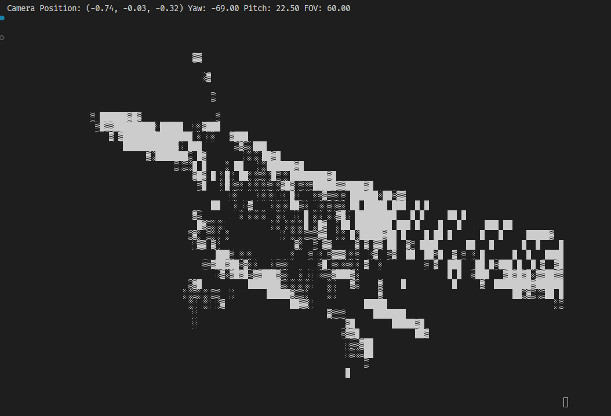
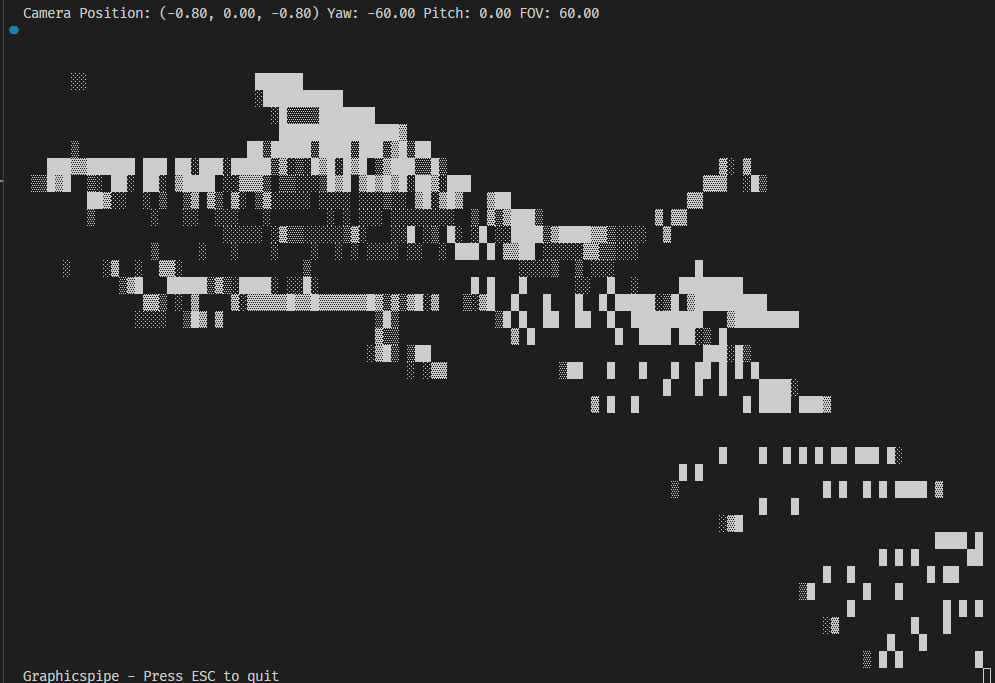
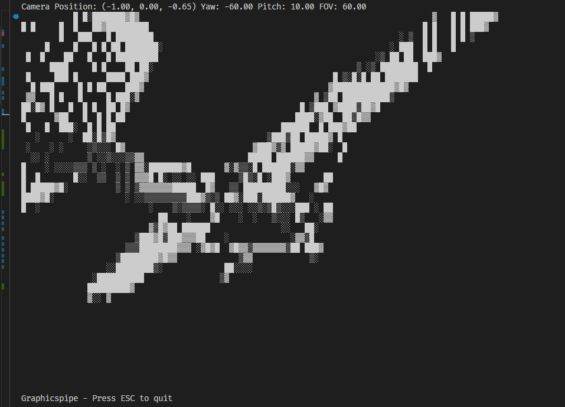

# 3D ASCII Graphics Pipeline

This project demonstrates a ASCII rendering of a plane in the terminal. The rendering pipeline is implemented in Python, without relying on any external graphics libraries.

## Snapshots

## Video Demonstration

Click the image below to watch the video.

